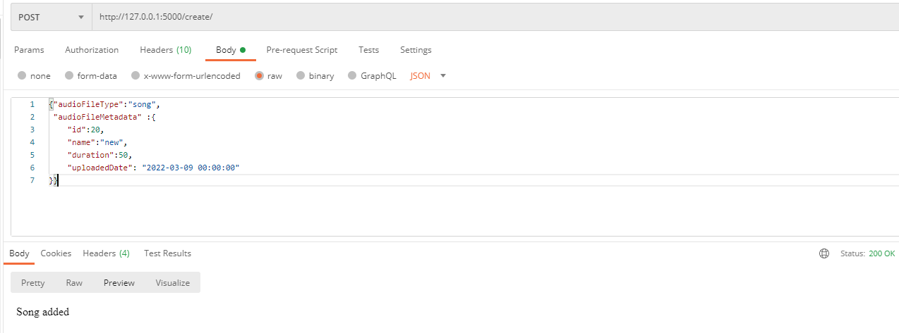
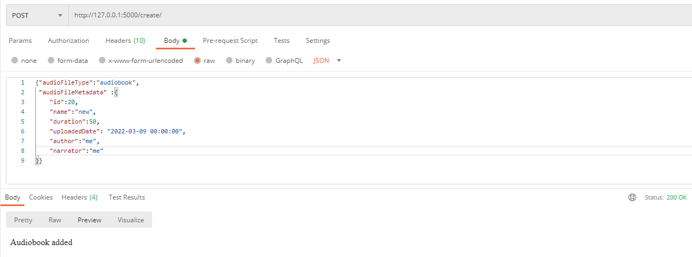
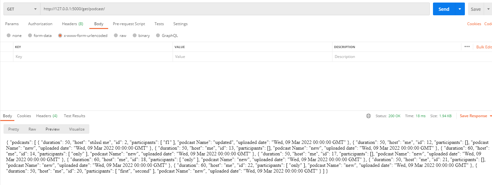
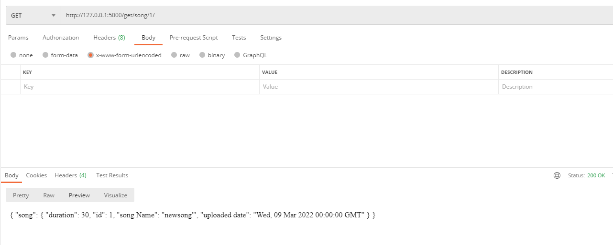
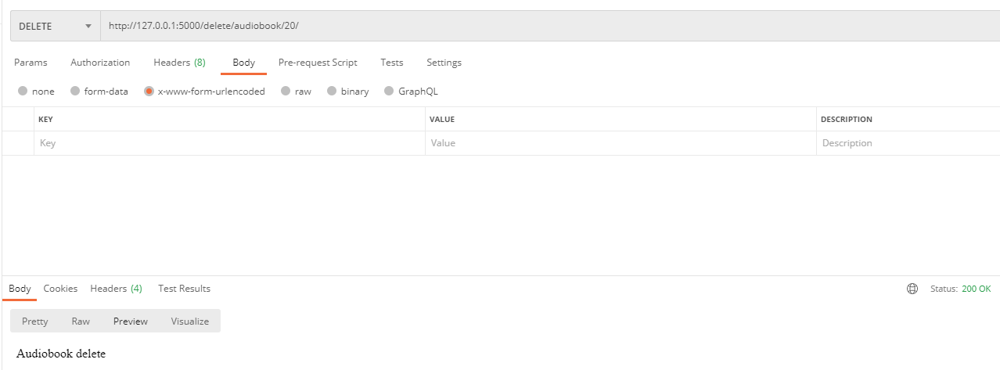
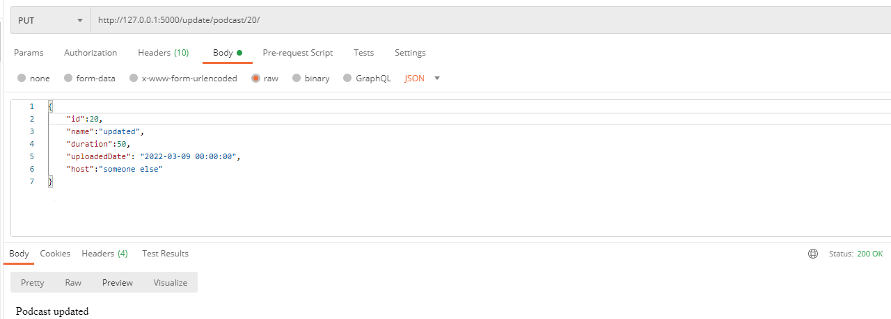

# Audio Server Simulation

This flask web app simulates an audio server that accepts songs,podcasts and audiobooks.

## Use Cases:

### Add a song:

### Add a podcast:

### Add an audiobook:

### Get all audio of a certain type (eg:type podcast):

### Get a single audio file (eg:song):

### Delete a single audio file (eg:audiobook):

### Update a single audio file (eg:podcast):
